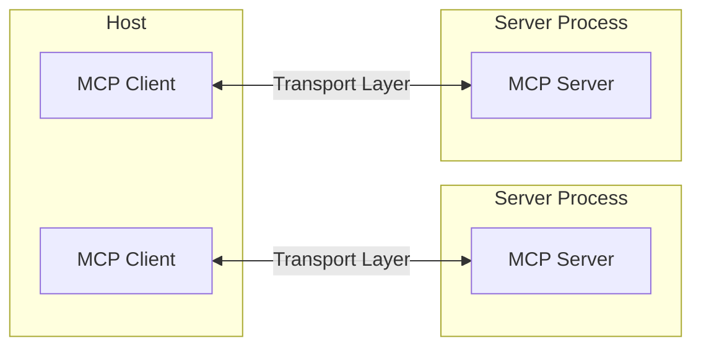
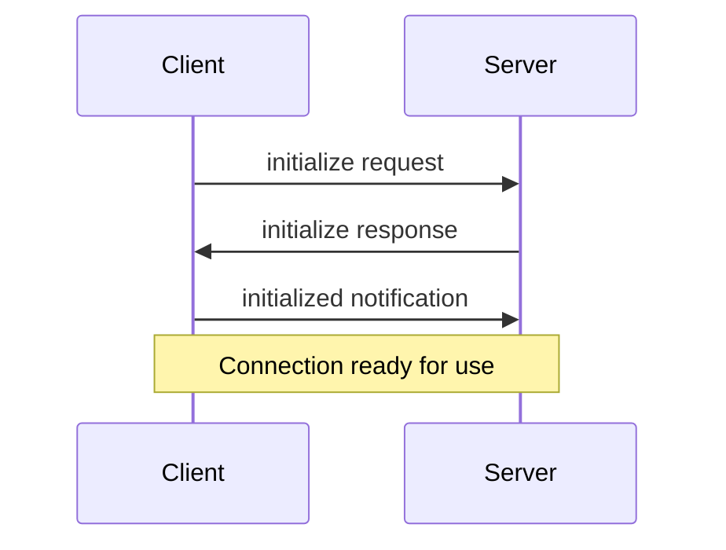

The Model Context Protocol (MCP) is built on a flexible, extensible architecture that enables seamless communication between LLM applications and integrations. This document covers the core architectural components and concepts.

模型上下文协议（Model Context Protocol，MCP）建立在灵活、可扩展的架构之上，实现了 LLM 应用程序和集成之间的无缝通信。本文档涵盖了核心架构组件和概念。

## Overview | 概述

MCP follows a client-server architecture where:

MCP 遵循客户端-服务器架构，其中：

- **Hosts** are LLM applications (like Claude Desktop or IDEs) that initiate connections
- **Clients** maintain 1:1 connections with servers, inside the host application
- **Servers** provide context, tools, and prompts to clients

- **Hosts（主机）** 是发起连接的 LLM 应用程序（如 Claude Desktop 或 IDE）
- **Clients（客户端）** 在主机应用程序内部与服务器保持 1:1 连接
- **Servers（服务器）** 为客户端提供上下文、工具和提示



## Core components | 核心组件

### Protocol layer | 协议层

The protocol layer handles message framing, request/response linking, and high-level communication patterns.

协议层处理消息帧、请求/响应链接和高级通信模式。

<Tabs>
  <Tab title="TypeScript">
    ```typescript
    class Protocol<Request, Notification, Result> {
        // Handle incoming requests | 处理传入请求
        setRequestHandler<T>(schema: T, handler: (request: T, extra: RequestHandlerExtra) => Promise<Result>): void

        // Handle incoming notifications | 处理传入通知
        setNotificationHandler<T>(schema: T, handler: (notification: T) => Promise<void>): void

        // Send requests and await responses | 发送请求并等待响应
        request<T>(request: Request, schema: T, options?: RequestOptions): Promise<T>

        // Send one-way notifications | 发送单向通知
        notification(notification: Notification): Promise<void>
    }
    ```
  </Tab>
  <Tab title="Python">
    ```python
    class Session(BaseSession[RequestT, NotificationT, ResultT]):
        async def send_request(
            self,
            request: RequestT,
            result_type: type[Result]
        ) -> Result:
            """Send request and wait for response. Raises McpError if response contains error.
            发送请求并等待响应。如果响应包含错误则引发 McpError。"""
            # Request handling implementation

        async def send_notification(
            self,
            notification: NotificationT
        ) -> None:
            """Send one-way notification that doesn't expect response.
            发送不需要响应的单向通知。"""
            # Notification handling implementation

        async def _received_request(
            self,
            responder: RequestResponder[ReceiveRequestT, ResultT]
        ) -> None:
            """Handle incoming request from other side.
            处理来自对方的传入请求。"""
            # Request handling implementation

        async def _received_notification(
            self,
            notification: ReceiveNotificationT
        ) -> None:
            """Handle incoming notification from other side.
            处理来自对方的传入通知。"""
            # Notification handling implementation
    ```
  </Tab>
</Tabs>

Key classes include:

主要类包括：

* `Protocol`
* `Client`
* `Server`

### Transport layer | 传输层

The transport layer handles the actual communication between clients and servers. MCP supports multiple transport mechanisms:

传输层处理客户端和服务器之间的实际通信。MCP 支持多种传输机制：

1. **Stdio transport | 标准输入输出传输**
   - Uses standard input/output for communication | 使用标准输入/输出进行通信
   - Ideal for local processes | 适用于本地进程

2. **HTTP with SSE transport | 基于 SSE 的 HTTP 传输**
   - Uses Server-Sent Events for server-to-client messages | 使用服务器发送事件（SSE）进行服务器到客户端的消息传输
   - HTTP POST for client-to-server messages | 使用 HTTP POST 进行客户端到服务器的消息传输

All transports use [JSON-RPC](https://www.jsonrpc.org/) 2.0 to exchange messages. See the [specification](/specification/) for detailed information about the Model Context Protocol message format.

所有传输都使用 [JSON-RPC](https://www.jsonrpc.org/) 2.0 来交换消息。有关模型上下文协议消息格式的详细信息，请参阅[规范](/specification/)。

### Message types | 消息类型

MCP has these main types of messages:

MCP 有以下主要消息类型：

1. **Requests | 请求** expect a response from the other side | 期望从对方获得响应:
    ```typescript
    interface Request {
      method: string;
      params?: { ... };
    }
    ```

2. **Results | 结果** are successful responses to requests | 是对请求的成功响应:
    ```typescript
    interface Result {
      [key: string]: unknown;
    }
    ```

3. **Errors | 错误** indicate that a request failed | 表示请求失败:
    ```typescript
    interface Error {
      code: number;
      message: string;
      data?: unknown;
    }
    ```

4. **Notifications | 通知** are one-way messages that don't expect a response | 是不期望响应的单向消息:
    ```typescript
    interface Notification {
      method: string;
      params?: { ... };
    }
    ```

## Connection lifecycle | 连接生命周期

### 1. Initialization | 初始化



1. Client sends `initialize` request with protocol version and capabilities
2. Server responds with its protocol version and capabilities
3. Client sends `initialized` notification as acknowledgment
4. Normal message exchange begins

1. 客户端发送带有协议版本和功能的 `initialize` 请求
2. 服务器响应其协议版本和功能
3. 客户端发送 `initialized` 通知作为确认
4. 开始正常的消息交换

### 2. Message exchange | 消息交换

After initialization, the following patterns are supported:

初始化后，支持以下模式：

- **Request-Response**: Client or server sends requests, the other responds
- **Notifications**: Either party sends one-way messages

- **请求-响应**：客户端或服务器发送请求，另一方响应
- **通知**：任何一方发送单向消息

### 3. Termination | 终止

Either party can terminate the connection:
- Clean shutdown via `close()`
- Transport disconnection
- Error conditions

任何一方都可以终止连接：
- 通过 `close()` 进行清理关闭
- 传输断开
- 错误条件

## Error handling | 错误处理

MCP defines these standard error codes:

MCP 定义了以下标准错误代码：

```typescript
enum ErrorCode {
  // Standard JSON-RPC error codes | 标准 JSON-RPC 错误代码
  ParseError = -32700,
  InvalidRequest = -32600,
  MethodNotFound = -32601,
  InvalidParams = -32602,
  InternalError = -32603
}
```

SDKs and applications can define their own error codes above -32000.

SDK 和应用程序可以定义自己的错误代码（大于 -32000）。

Errors are propagated through:
- Error responses to requests
- Error events on transports
- Protocol-level error handlers

错误通过以下方式传播：
- 对请求的错误响应
- 传输层的错误事件
- 协议级错误处理程序

## Implementation example | 实现示例

Here's a basic example of implementing an MCP server:

以下是实现 MCP 服务器的基本示例：

<Tabs>
  <Tab title="TypeScript">
    ```typescript
    import { Server } from "@modelcontextprotocol/sdk/server/index.js";
    import { StdioServerTransport } from "@modelcontextprotocol/sdk/server/stdio.js";

    const server = new Server({
      name: "example-server",
      version: "1.0.0"
    }, {
      capabilities: {
        resources: {}
      }
    });

    // Handle requests | 处理请求
    server.setRequestHandler(ListResourcesRequestSchema, async () => {
      return {
        resources: [
          {
            uri: "example://resource",
            name: "Example Resource"
          }
        ]
      };
    });

    // Connect transport | 连接传输
    const transport = new StdioServerTransport();
    await server.connect(transport);
    ```
  </Tab>
  <Tab title="Python">
    ```python
    import asyncio
    import mcp.types as types
    from mcp.server import Server
    from mcp.server.stdio import stdio_server

    app = Server("example-server")

    @app.list_resources()
    async def list_resources() -> list[types.Resource]:
        return [
            types.Resource(
                uri="example://resource",
                name="Example Resource"
            )
        ]

    async def main():
        async with stdio_server() as streams:
            await app.run(
                streams[0],
                streams[1],
                app.create_initialization_options()
            )

    if __name__ == "__main__":
        asyncio.run(main())
    ```
  </Tab>
</Tabs>

## Best practices | 最佳实践

### Transport selection | 传输选择

1. **Local communication | 本地通信**
   - Use stdio transport for local processes | 对本地进程使用标准输入输出传输
   - Efficient for same-machine communication | 适用于同一机器上的通信
   - Simple process management | 简单的进程管理

2. **Remote communication | 远程通信**
   - Use SSE for scenarios requiring HTTP compatibility | 在需要 HTTP 兼容性的场景中使用 SSE
   - Consider security implications including authentication and authorization | 考虑包括身份验证和授权在内的安全影响

### Message handling | 消息处理

1. **Request processing | 请求处理**
   - Validate inputs thoroughly | 彻底验证输入
   - Use type-safe schemas | 使用类型安全的模式
   - Handle errors gracefully | 优雅地处理错误
   - Implement timeouts | 实现超时机制

2. **Progress reporting | 进度报告**
   - Use progress tokens for long operations | 对长时间操作使用进度令牌
   - Report progress incrementally | 增量报告进度
   - Include total progress when known | 在已知时包含总进度

3. **Error management | 错误管理**
   - Use appropriate error codes | 使用适当的错误代码
   - Include helpful error messages | 包含有用的错误消息
   - Clean up resources on errors | 在错误时清理资源

## Security considerations | 安全考虑

1. **Transport security | 传输安全**
   - Use TLS for remote connections | 对远程连接使用 TLS
   - Validate connection origins | 验证连接来源
   - Implement authentication when needed | 在需要时实现身份验证

2. **Message validation | 消息验证**
   - Validate all incoming messages | 验证所有传入消息
   - Sanitize inputs | 净化输入
   - Check message size limits | 检查消息大小限制
   - Verify JSON-RPC format | 验证 JSON-RPC 格式

3. **Resource protection | 资源保护**
   - Implement access controls | 实现访问控制
   - Validate resource paths | 验证资源路径
   - Monitor resource usage | 监控资源使用
   - Rate limit requests | 限制请求速率

4. **Error handling | 错误处理**
   - Don't leak sensitive information | 不要泄露敏感信息
   - Log security-relevant errors | 记录与安全相关的错误
   - Implement proper cleanup | 实现适当的清理
   - Handle DoS scenarios | 处理 DoS 场景

## Debugging and monitoring | 调试和监控

1. **Logging | 日志记录**
   - Log protocol events | 记录协议事件
   - Track message flow | 跟踪消息流
   - Monitor performance | 监控性能
   - Record errors | 记录错误

2. **Diagnostics | 诊断**
   - Implement health checks | 实现健康检查
   - Monitor connection state | 监控连接状态
   - Track resource usage | 跟踪资源使用
   - Profile performance | 性能分析

3. **Testing | 测试**
   - Test different transports | 测试不同的传输方式
   - Verify error handling | 验证错误处理
   - Check edge cases | 检查边界情况
   - Load test servers | 负载测试服务器
